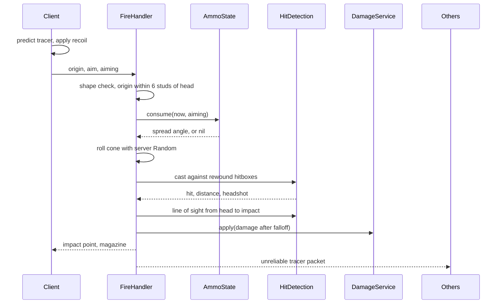

# Gun System

Hitscan weapons where the server decides everything that matters. The client sends where it is aiming, nothing else. Damage, spread, ammo and hit detection all happen on the server, on rewound positions so that shots land where the shooter saw the target.

Two weapons are configured, an automatic rifle and a semi automatic pistol. Adding a third is a table entry in `WeaponConfig`.

## Trust model

This is the part I actually care about in a shooter, so it is worth being precise about it.

| Decision | Owner | Why |
| --- | --- | --- |
| Where the player is aiming | Client | Only the client knows the camera, and it is going to lie about it either way |
| Muzzle position | Client, validated | Must be within 6 studs of the server side head position or the packet is dropped |
| Spread applied to the shot | Server | The server rolls the cone with its own `Random` and its own bloom counter |
| Whether a shot was fired at all | Server | Fire rate, magazine and reload state live in `AmmoState` |
| What the bullet hit | Server | The server casts against rewound hitboxes, the client never reports a target |
| How much damage | Server | Distance falloff and headshot multiplier are applied where they cannot be edited |

A client that sends a perfectly crafted packet every 85 milliseconds gets exactly what a legitimate client gets. There is no field in the packet that can turn into extra damage, and there is nothing to gain from sending more of them.

What a client can still do is aim perfectly. No server can tell an aimbot from a good player through a network packet, and pretending otherwise in a README would be dishonest. That is a behaviour detection problem, not a validation problem.

## Shot flow



## Lag compensation

Every heartbeat `Rewind` stores the `HumanoidRootPart` and `Head` CFrames of every character, keeping one second of history. When a shot arrives, the server rewinds each candidate to `os.clock() - ping`, clamped to 250 milliseconds, and tests against those positions instead of current ones.

Without this, a player with 120 ms of latency has to lead every moving target by about a body width. With it, the shot is judged against the world the shooter actually saw.

The clamp is the important part. Uncapped rewind means a client with a faked high ping shoots at where you stood a second ago, which is the classic way lag compensation turns into an exploit.

Snapshots are interpolated between the two nearest samples rather than snapped to the closest one, so a shot in between heartbeats is not resolved against a position the target never occupied.

## Hit detection

Hit detection does not use `workspace:Raycast` against characters. It cannot, because the characters have moved since the snapshot. Instead it runs a ray against oriented boxes at the rewound CFrames, using the slab method in each box's local space:

- Head box, 1.6 studs cubed at the head CFrame
- Body box, 2.4 by 4.2 by 1.8 studs at the root CFrame

The nearer of the two decides whether it is a headshot. The sizes are tuned for R15 and are deliberately a little generous, which is what players expect from a Roblox shooter.

Geometry is still handled by the engine. After a character hit is found, one raycast from the shooter's head to the impact point checks that a wall is not in the way. Characters are excluded from that raycast, so shooting a target standing behind a teammate works. Turning that into a body block is a one line change in `characterFilter`.

## Spread and recoil

Bloom grows with `spread.perShot` on every shot up to `spread.max`, and decays at `spread.decay` degrees per second. Both sides run the same maths from the same config, the client so the crosshair and the predicted tracer are right, the server because it is the one that actually rolls the cone.

Cone sampling is uniform over the solid angle, not over the angle:

```
polar = acos(1 - u * (1 - cos(maxAngle)))
```

Sampling the angle directly clusters shots near the centre of the cone, which makes a weapon feel more accurate than its numbers say.

Recoil is a critically damped spring on a `Vector2`, stepped in fixed 1/120 second slices so the behaviour does not change with frame rate. It is applied to the camera one priority step after the camera update, so it kicks the view and therefore the shot direction, then settles back. It does not permanently move the player's aim.

## Ammo

`AmmoState` keeps a pocket per weapon, so swapping to the pistol and back does not refill the rifle. Swaps are limited to one per 250 ms, and a swap cancels a reload in progress.

Reloads use a token. `beginReload` increments it, the completion is scheduled with `task.delay`, and it only lands if the token still matches. Without that, a player who reloads, swaps weapons and swaps back gets ammo from a reload that belonged to a different gun.

The client predicts its own magazine so the counter does not lag behind the trigger, and every server reply carries the authoritative count. If the server rejects a shot, it pushes an ammo report so the client resyncs immediately instead of drifting.

## Remotes

| Remote | Direction | Payload |
| --- | --- | --- |
| `WeaponFire` | Client to server | `weaponId`, `origin`, `aim`, `aiming` |
| `WeaponReload` | Client to server | Nothing |
| `WeaponEquip` | Client to server | `weaponId` |
| `WeaponShot` | Server to shooter | Impact point, damage, headshot, magazine |
| `WeaponAmmo` | Server to shooter | Full ammo state after equip, reload or rejection |
| `WeaponTracer` | Server to everyone else | Unreliable, origin and impact for the tracer |

`WeaponTracer` is an `UnreliableRemoteEvent` on purpose. A tracer that arrives late is worse than a tracer that never arrives, and at 700 rounds per minute in a full server this is the traffic that adds up.

## Weapon config

| Field | Meaning |
| --- | --- |
| `roundsPerMinute` | Converted to a fire interval, enforced with a 20 ms tolerance for jitter |
| `damage`, `headshotMultiplier` | Base damage before falloff |
| `falloffStart`, `falloffEnd`, `falloffFloor` | Linear falloff, never below `damage * falloffFloor` |
| `spread` | `hip`, `aim`, `perShot`, `decay`, `max`, all in degrees |
| `recoil` | Spring impulse and constants, degrees per shot |
| `magazineSize`, `reserveAmmo`, `reloadTime` | Ammo economy |

Configs are frozen at require time and validated, so a typo like a `falloffEnd` below `falloffStart` fails on the first server start instead of quietly producing negative damage.

## Left out on purpose

- No viewmodel, no animations, no sound. Those are art driven and every project wants them their own way.
- No Tool instances. Equipping goes through the controller so the system does not care whether the game uses tools, a hotbar or a class system.
- No penetration, no ricochet, no projectile drop. This is hitscan, and mixing the two in a showcase would blur the part worth showing.
- No hit markers or damage numbers. `WeaponShot` carries everything a UI needs for them.
- No anti cheat beyond input validation. Detecting inhuman accuracy belongs in its own system with its own data.

## Files

| File | Role |
| --- | --- |
| `src/shared/WeaponConfig.luau` | Weapon tables, frozen and validated |
| `src/shared/Ballistics.luau` | Fire interval, falloff, bloom, cone sampling |
| `src/shared/Types.luau` | Packet and report shapes shared by both sides |
| `src/shared/Remotes.luau` | Remote creation and lookup |
| `src/server/FireHandler.luau` | Packet validation and the shot pipeline |
| `src/server/AmmoState.luau` | Fire rate, magazines, reloads, bloom |
| `src/server/Rewind.luau` | One second of character position history |
| `src/server/HitDetection.luau` | Ray against oriented boxes, line of sight, world casts |
| `src/server/DamageService.luau` | Team and force field checks, damage application, kill signal |
| `src/client/WeaponController.luau` | Input state, prediction, remote traffic |
| `src/client/RecoilSpring.luau` | Fixed step damped spring |
| `src/client/TracerEmitter.luau` | Pooled tracer and impact parts |
