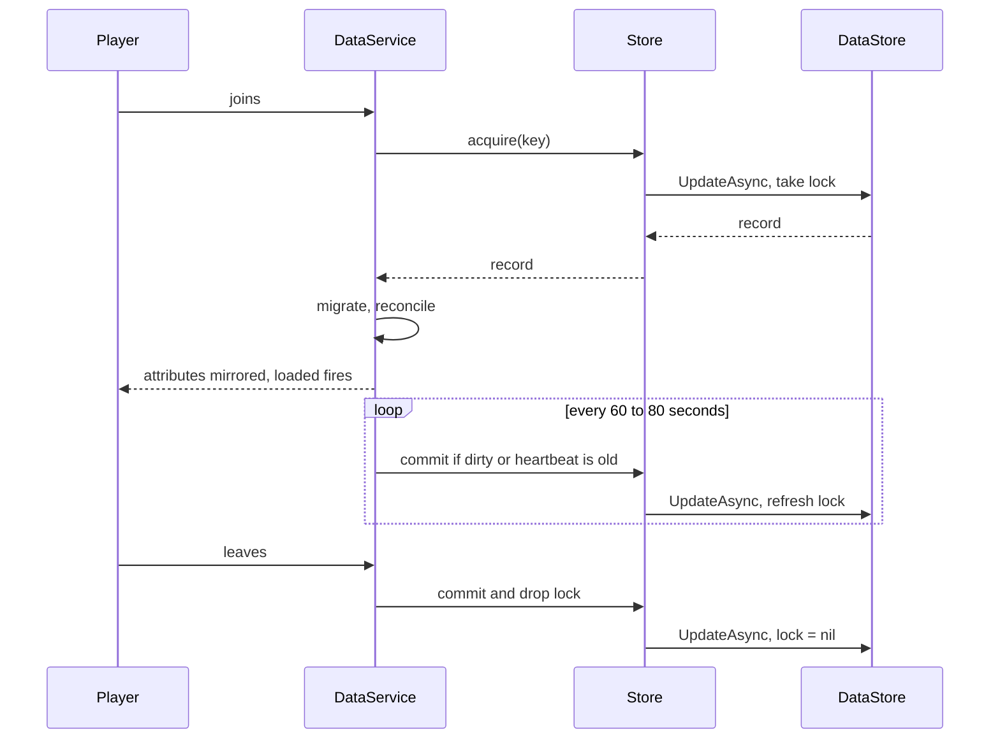

# Player Data

Session locked player storage on top of `DataStoreService`. One profile per player, one owner at a time, versioned data with migrations.

This is the system I would not let a game ship without. Everything else can be patched after release, data loss cannot.

## Why a session lock

Roblox can run the same player on two servers at the same time. It happens on teleports, on server shutdowns, and any time a player rejoins faster than the old server saves. Without a lock, the second server loads a copy of the data, both servers keep writing, and the last writer wins. Players call that "my items are gone".

The lock lives inside the record itself, so acquiring it and reading the data is a single `UpdateAsync` call and cannot race:

```
{
  version = 4,
  data    = { ... },
  lock    = { jobId = "...", placeId = 123, heartbeat = 1770000000 },
  meta    = { created, updated, saves, placeVersion }
}
```

- Loading takes the lock, or the transform returns `nil` and the write is cancelled.
- Every save rewrites `lock.heartbeat`, which is why an idle profile is still saved every 4 minutes even when nothing changed. Otherwise its lock would go stale under a player who never left.
- A lock is considered dead after 10 minutes without a heartbeat and can be taken over. That is long enough to survive a crashed server and short enough that a stuck player is not locked out for a whole session.
- Saving checks the lock first. If another server took it over, this server drops the data instead of writing over it and the player is released.

A rejoining player hits `loadRetry`, 5 attempts with exponential backoff and jitter, which covers the normal case of the old server still finishing its final save. If it is still locked after that, the player gets a kick message that tells them to rejoin instead of a silent fresh profile.

## Lifecycle



## Versioning

`Schema.VERSION` is the current shape, `Migrations.STEPS[n]` upgrades a record from version `n` to `n + 1`. Steps run in order until the record reaches the current version, so a profile that has not been touched since v1 catches up in one load.

| Step | Change |
| --- | --- |
| 1 to 2 | Flat `coins` and `gems` moved into a `currency` table |
| 2 to 3 | `pets` changed from a list of ids to a count map plus an `equipped` list |
| 3 to 4 | `stats.playtime` became integer `stats.playtimeSeconds`, `bestRarity` added |

Two rules I keep to:

- A migration step never reads `Schema.template()`. The template moves on, the step has to describe the world as it was when it was written or it breaks the next time the template changes.
- Data written by a newer place version is never migrated downwards. The player is kicked with a clear message and the record is left alone. Rolling a place back should not eat inventories.

After migrations, `Reconcile.fill` walks the template and adds any key the record is missing, including keys with the wrong type. Adding a field to `Schema.template` is all you need to do to ship it.

## Public API

```lua
local DataService = require(ServerScriptService.DataService)

DataService.start()

local profile = DataService.await(player)
if not profile then
	return
end

profile.data.currency.coins += 100
profile:markDirty()
```

| Member | Behaviour |
| --- | --- |
| `DataService.start()` | Hooks players, autosave and `BindToClose`. Safe to call twice |
| `DataService.get(player)` | The loaded profile or `nil`, never yields |
| `DataService.await(player, timeout?)` | Yields until the profile is loaded, returns `nil` if the player leaves first |
| `DataService.loaded` | Fires with `(player, profile)` once per successful load |
| `profile.data` | The live table. Write to it directly |
| `profile:markDirty()` | Tells autosave there is something to write |
| `profile:save(force?)` | Writes now, throttled to one write per 7 seconds unless forced |
| `profile:release()` | Final write and lock release. Called for you on leave and on shutdown |
| `profile.released` | Fires with `(saved: boolean)` when the profile stops being usable |

`markDirty` is manual on purpose. Change tracking through proxies or deep comparison costs more than it saves, and a system that saves every profile every minute whether it changed or not burns request budget you will want later.

## Failure handling

| Failure | What happens |
| --- | --- |
| DataStore throws while loading | 5 attempts, delays of 2, 4, 8, 16, 20 seconds with jitter, then a kick |
| Profile locked by another server | Same retry loop, then a kick that names the reason |
| DataStore throws while saving | 3 attempts, profile stays dirty so the next autosave tries again |
| Lock taken over mid session | Retry stops immediately, profile goes inactive, player is kicked |
| Record from a newer schema | Lock released, player kicked, record untouched |
| Server shuts down | `BindToClose` releases every profile in parallel, up to 25 seconds |

The jitter on backoff matters more than it looks. Without it, a DataStore hiccup makes 40 servers retry in the exact same second and the outage lasts longer than it had to.

`Retry.fatal` is how the retry loop tells the difference between "try again" and "stop, this will never work". Retrying a lost lock 3 times just delays the kick.

## Running it in Studio

If API access is off, `Store` falls back to `MemoryBackend`, an in memory implementation of the same one method interface, and prints a warning. The whole system runs in a Studio playtest, saves included, and nothing persists. That beats commenting out the DataStore calls and forgetting to put them back.

`Store.useBackend()` takes the same interface, which is also how the load and save paths can be tested without touching a real DataStore.

## Left out on purpose

- No cross server messaging. A `MemoryStoreService` hash map next to the lock would let a shutting down server tell the new one it is done, instead of the new one waiting out its backoff. It is worth doing, it is just a second service and this repo is about showing the pattern.
- No `GetVersionAsync` rollback tooling. Roblox keeps 30 days of versions and a support tool on top of it is a nice thing to have, but it belongs to an admin panel, not to the storage layer.
- No client replication beyond `Mirror`, which pushes four whitelisted fields to player attributes. Anything richer depends on the UI framework of the game.
- No ordered data stores, no leaderboards.

## Files

| File | Role |
| --- | --- |
| `init.luau` | Public API, load and unload flow, autosave loop, shutdown |
| `Store.luau` | `UpdateAsync` flows for acquire and commit, budget waiting, backend choice |
| `SessionLock.luau` | Pure lock predicates, no side effects, trivial to test |
| `Profile.luau` | Per player handle, dirty flag, save throttle, release |
| `Schema.luau` | Current data shape and the default template |
| `Migrations.luau` | Version upgrade steps |
| `Reconcile.luau` | Deep copy and template fill |
| `Retry.luau` | Exponential backoff with jitter and a fatal escape hatch |
| `MemoryBackend.luau` | Studio fallback with the same interface as the real store |
| `Mirror.luau` | Whitelisted data pushed to player attributes for the client |
| `Config.luau` | Every timing constant and kick message in one frozen table |
